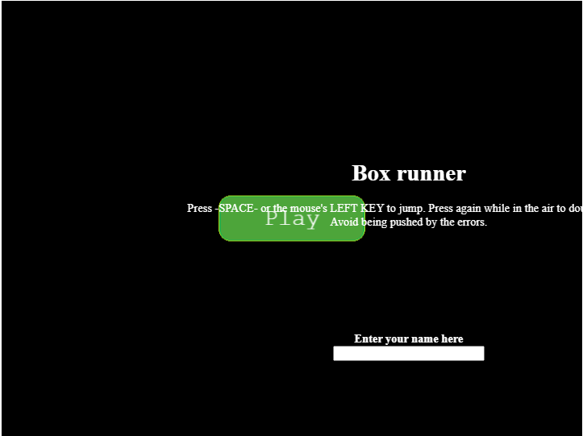

# Endless-Runner

> Endless runner game made with phaser JS

- Endless runner game where you control a moving box that is running and avoiding errors
- Press SPACE or LEFT MOUSE keys to jump
- You can press again to double jump

You can check the game design document by following [this link](./GDD.md)

## Built With 

- JavaScript, HTML5 and Bootstrap

## Live Demo

[Live Demo](https://60fc1db24103d720d5335c90--adoring-turing-b7fcf6.netlify.app/)
### Prerequisites

- Modern Browser (Chrome, Firefox...)
- Node.js
## Getting Started

To get a local copy up and running follow these simple example steps.

- clone the repo  `git clone `
- `cd ENDLESS-RUNNER`
- `npm install`
- Run `npm run dev` to start the server
- Open http://localhost:8080/ and enjoy the Game.

## Test

- To run tests `npm test` in the root directory

# Author

👤 **Ralph Oburu**

- GitHub: [Ralph-1](https://github.com/Ralph-1)
- Twitter: [@NotRalph0](https://twitter.com/NotRalph0)
- LinkedIn: [Ralph](https://www.linkedin.com/in/ralph-oburu)

## 🤝 Contributing

Contributions, issues and feature requests are welcome!

Feel free to check the [issues page](https://github.com/Ralph-1/Endless-Runner/issues).

## Show your support

Give a ⭐️ if you like this project!

## 📝 License

Permission is hereby granted, free of charge, to any person obtaining a copy of this software and associated documentation files (the "Software"), to deal in the Software without restriction, including without limitation the rights to use, copy, modify, merge, publish, distribute, sublicense, and/or sell copies of the Software, and to permit persons to whom the Software is furnished to do so, subject to the following conditions:

The above copyright notice and this permission notice shall be included in all copies or substantial portions of the Software.

THE SOFTWARE IS PROVIDED "AS IS", WITHOUT WARRANTY OF ANY KIND, EXPRESS OR IMPLIED, INCLUDING BUT NOT LIMITED TO THE WARRANTIES OF MERCHANTABILITY, FITNESS FOR A PARTICULAR PURPOSE AND NONINFRINGEMENT. IN NO EVENT SHALL THE AUTHORS OR COPYRIGHT HOLDERS BE LIABLE FOR ANY CLAIM, DAMAGES OR OTHER LIABILITY, WHETHER IN AN ACTION OF CONTRACT, TORT OR OTHERWISE, ARISING FROM, OUT OF OR IN CONNECTION WITH THE SOFTWARE OR THE USE OR OTHER DEALINGS IN THE SOFTWARE.
